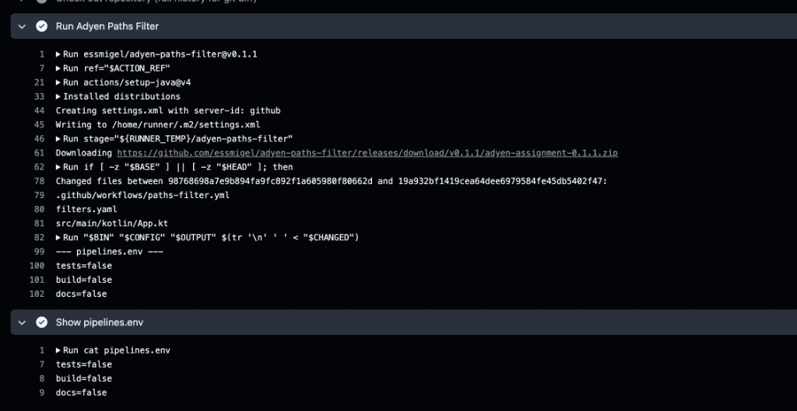
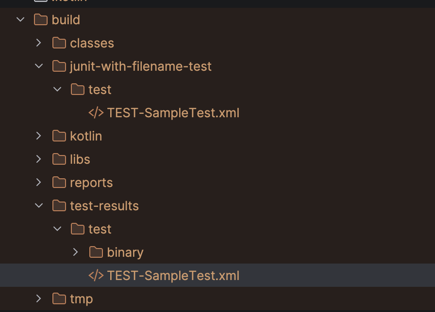

# Adyen Test Project

A small sample Gradle project that ties together the two deliverables of the Adyen coding assignment. The actual implementations live in their own repositories; this repo is the consumer that proves they work end‑to‑end.

- **Part 1 — CI/CD path‑based filter**: implemented as a Kotlin CLI / GitHub Action in [`essmigel/adyen-paths-filter`](https://github.com/essmigel/adyen-paths-filter), and consumed here from a GitHub Actions workflow.
- **Part 2 — JUnit XML `filename` Gradle plugin**: implemented in [`essmigel/adyen-junit-filename-plugin`](https://github.com/essmigel/adyen-junit-filename-plugin), and consumed here from `mavenLocal()` on the [`use-adyen-junit-filename-locally`](../../tree/use-adyen-junit-filename-locally) branch.

## Part 1 — Using `adyen-paths-filter` in CI

The repo includes a single workflow at `.github/workflows/paths-filter.yml` that runs on every pull request, calls the [`essmigel/adyen-paths-filter`](https://github.com/essmigel/adyen-paths-filter) action against the `filters.yaml` in this repo, and prints the resulting `pipelines.env`.

`filters.yaml`:

```yaml
filters:
  sources:
    - 'src/main/**'
  tests:
    - 'src/test/**'
  build:
    - 'build.gradle.kts'
    - 'settings.gradle.kts'
    - 'gradle.properties'
    - 'gradle/**'
  docs:
    - '**/*.md'
```

Workflow step that invokes the action:

```yaml
- name: Run Adyen Paths Filter
  uses: essmigel/adyen-paths-filter@v0.1.0
  with:
    config: filters.yaml

- name: Show pipelines.env
  run: cat pipelines.env
```

A worked end‑to‑end run of the action — including the diff it computes, the patterns from `filters.yaml`, and the resulting `pipelines.env` — is visible on the action's own PR: [`adyen-paths-filter#1`](https://github.com/essmigel/adyen-paths-filter/pull/1).

Example output from this repo's workflow:



## Part 2 — Using `adyen-junit-filename-plugin` from `mavenLocal()`

The plugin lives in [`essmigel/adyen-junit-filename-plugin`](https://github.com/essmigel/adyen-junit-filename-plugin). To keep `main` clean, the integration is demonstrated on a dedicated branch: [`use-adyen-junit-filename-locally`](../../tree/use-adyen-junit-filename-locally).

To reproduce the result locally:

1. In the plugin repo, publish to your local Maven repository:

   ```bash
   ./gradlew :plugin:publishToMavenLocal
   ```

2. In this repo, switch to the integration branch:

   ```bash
   git checkout use-adyen-junit-filename-locally
   ```

   On that branch, `settings.gradle.kts` adds `mavenLocal()` to plugin management and `build.gradle.kts` applies the plugin and configures the output directory:

   ```kotlin
   // settings.gradle.kts
   pluginManagement {
       repositories {
           mavenLocal()
           gradlePluginPortal()
       }
   }
   ```

   ```kotlin
   // build.gradle.kts
   plugins {
       kotlin("jvm") version "2.3.20"
       id("org.adyen.junit-filename") version "1.0-SNAPSHOT"
   }

   junitFilename {
       outputDir = layout.buildDirectory.dir("junit-with-filename-test")
   }
   ```

3. Run the tests:

   ```bash
   ./gradlew test
   ```

The plugin leaves the original JUnit XML under `build/test-results/test/` untouched and writes augmented copies to the configured `build/junit-with-filename-test/test/` directory. Each `<testcase>` in the augmented XML carries the extra `filename` attribute (and `line` for failing tests).

Resulting `build/` layout after `./gradlew test` on the branch:


